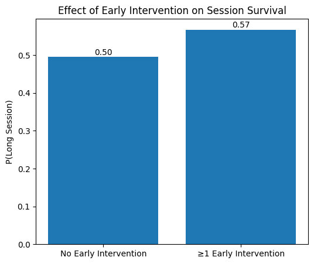

# Modeling Early-Session Engagement Dynamics Using Spotify Listening History

## Overview

This project analyzes ~240,000 Spotify listening events (~11,000 sessions) to investigate whether early-session behavior predicts session depth.

The goal is to understand whether early user actions, such as skipping or selecting tracks, reflect dissatisfaction or active calibration of the listening environment, and whether these behaviors influence overall engagement.

## Data

- Spotify Extended Streaming History export
- ~240K listening events
- ~11K sessions constructed using a 30-minute inactivity threshold

Each event includes:
- timestamp
- track metadata
- interaction type (e.g., skip, back, click)
- playback duration

*Note: Raw Spotify data is not included in this repository.*

## Methodology

### Session Construction
- Listening events grouped into sessions using a 30-minute inactivity threshold
- Sessions ordered chronologically
- Session depth defined as total tracks played

### Feature Engineering

**Fatigue**
- Track position used to measure how engagement changes over the course of a session

**Novelty**
- Absolute novelty: whether a track has been played before
- Relative novelty: time since last listen

**Early Session Features (first 3 tracks)**
- Early intervention rate
- Early first-listen rate
- Early mean recency

### Modeling
- Logistic regression used to test whether early-session features contain predictive information
- Target: whether a session exceeds 10 tracks

## Key Findings

- **Skip probability increases over the first few tracks before stabilizing**, suggesting an early-session calibration phase rather than a gradual fatigue effect.
- **Track novelty and recency alone do not strongly predict session depth.**
- **Sessions with at least one early intervention are more likely to become long sessions** than sessions with no early intervention.

These results suggest that early user actions may reflect **active calibration of the listening environment**, rather than immediate dissatisfaction.

## Example Result

Early intervention vs. probability of long session:

## Repository Structure
    .
    ├── figures/
    │   └── early_intervention.png  # Visualization used in README
    ├── notebook/
    │   └── analysis.ipynb          # Full analysis workflow
    ├── data/                       # (Not included) Spotify streaming history JSON files
    ├── README.md
    └── requirements.txt

## Tech Stack

- Python
- Pandas
- NumPy
- Matplotlib
- Scikit-learn

## Summary

This project demonstrates how event-level listening data can be transformed into session-level behavioral insights.

Rather than focusing solely on predictive performance, the analysis highlights how early-session dynamics provide meaningful signals about user engagement and listening behavior.